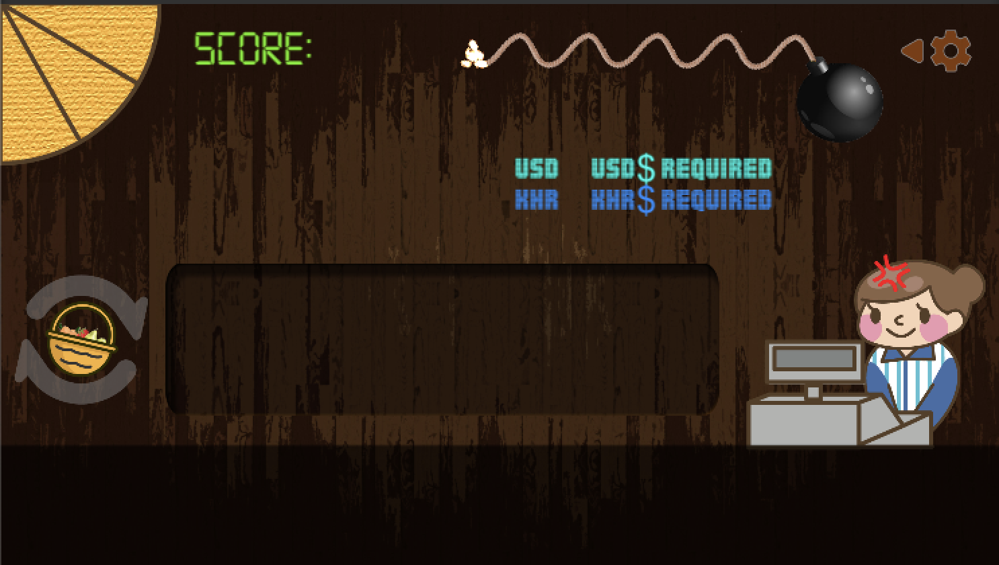

# Currency Exchange: An educational currency exchange training game

Currency Exchange is a math/currency game created for [Hope Training Centre](https://ohf.org.sg/tjsss-programme-cambodia/) located in Cambodia, Prey Veng. It was done in collaboration with [Operation Hope Foundation](https://ohf.org.sg) and [Renaissance Engineering Programme's HEAL Team](http://www.ntu.edu.sg/rep/reclub/Pages/Humanitarian-Engineers-and-Leaders.aspx)

The app can be downloaded from the Google Playstore!

[DOWNLOAD HERE](https://play.google.com/store/apps/details?id=com.nturepheal.currex)

## Code
    
One particular extension I'm proud of is the localisation system for the game. Localisation packages are wrapped in individual asset files, and changing languages or adding languages is as easy as making a new asset file in Unity and filling it up with the relevant unicode text for that language. For this game, there isn't a lot of text to localise, but this system can be extended very easily as the system uses a dictionary to store and retrieve the localised strings. The dictionary is also supported by the editor and can be easily updated within the inspector.

### Files needed

The files needed are Localisation.cs, DictionaryDrawer.cs (editor script) and SerializableDictionary.cs. I can't remember where or how I found the SerializableDictionary, but that code was not written by me, so credits to that person! I needed a serializable dictionary for the editor script to work, and his was the best I could find.
